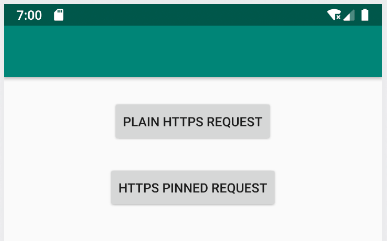
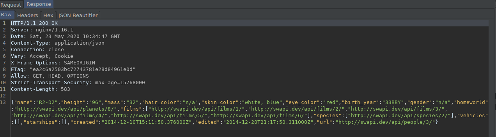
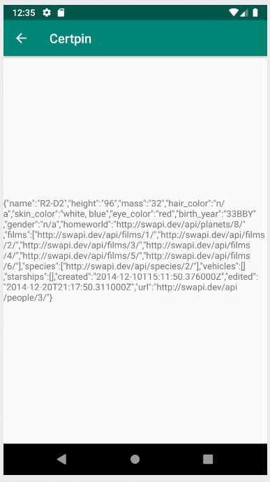
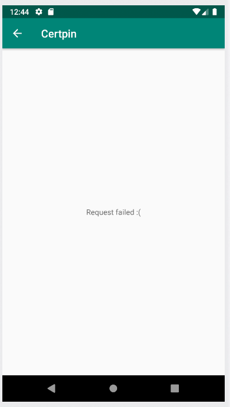

# Certificate pinning

## MitM on apps

b4 pinning we need to install root CA. Only browsers accept user provided certificates, applications only trust system certificates.

### Installing our root CA on the emulator

1. Obtain a writable `/system` partition
    1. Launch the emulator with the flag `-writable-system`
    2. Then obtain root on the system with `adb root`
    3. Then remount the `/system` partition as writeable with `adb remount`
    4. Test that the partition was mounted succesfully with `touch /system/test.txt`

2. Obtain the Root CA from burp
   1. Obtain the Burp Root certificate. Enter `http://burp` into a browser configured with burp and download the CA file.
   2. Move the file to the SD card on the device with `adb push cacert.der /mnt/sdcard/cacert.cer`. In this step we are also changing the file's extension

3. Install the Root CA
   1. On the android emulator go to `Security & location > Advanced > Encryption & credentials > Install from SD card`
   2. Select the `cacert.cer` file from the SD. Put any name and choose the `VPN and Apps` option

4. Set the certificate as System certificate
   1. Copy the certificate to the correct folder in the system partition with `cp /data/misc/user/0/cacerts-added/* /system/etc/security/cacerts`. Now the device trusts the certificate and will be used in app connections


### Using burp to perform MitM

With the certificate installed we can configure the emulator to use Burp as a proxy in order to intercept requests. We can see the request appear in burp and in the app without any problem




When performing a pinned request inside our app, the `Okhttp` library performs a check on the certificate provided. In this case, our installed certificate is not accepted by the app even if the system trusts it, as it does not pass the internal check

```java
CertificatePinner certpin = new CertificatePinner.Builder()
         .add(hostname, "sha256/eSiyNwaNIbIkI94wfLFmhq8/ATxm30i973pMZ669tZo=")
         .build();
```



### Bypassinc certificate pinning

```js
setTimeout(function() {
    Java.perform(function () {
      // OkHTTPv3 (double bypass)
      try {
         var okhttp3_Activity = Java.use('okhttp3.CertificatePinner');
         okhttp3_Activity.check.overload('java.lang.String', 'java.util.List').implementation = function (str) {
               console.log('[+] Bypassing OkHTTPv3 {1}: ' + str);
               return true;
         };
         // This method of CertificatePinner.check could be found in some old Android app
         okhttp3_Activity.check.overload('java.lang.String', 'java.security.cert.Certificate').implementation = function (str) {
               console.log('[+] Bypassing OkHTTPv3 {2}: ' + str);
               return true;
         };

      } catch (err) {
         console.log('[-] OkHTTPv3 pinner not found');
         //console.log(err);
      }
   }
}, 0);
```
