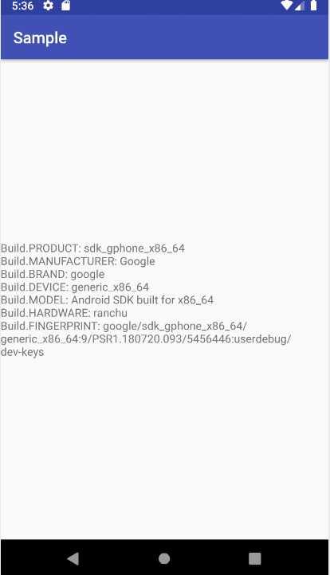
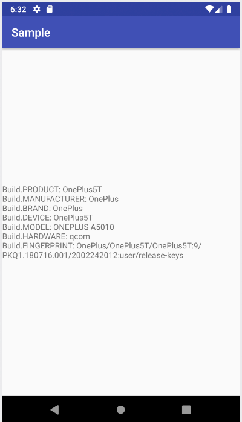

# Emulatordetection

In an emulator

| Parameter          | Emulator                                                                             | Real Phone                                                                 | `build.prop`            |
| ------------------ | ------------------------------------------------------------------------------------ | -------------------------------------------------------------------------- | ----------------------- |
| Build.PRODUCT      | sdk_gphone_x86_64                                                                    | OnePlus5T                                                                  | ro.product.name         |
| Build.MANUFACTURER | Google                                                                               | OnePlus                                                                    | ro.product.manufacturer |
| Build.BRAND        | google                                                                               | OnePlus                                                                    | ro.product.brand        |
| Build.DEVICE       | generic_x86_64                                                                       | OnePlus5T                                                                  | ro.product.device       |
| Build.MODEL        | Android SDK built for x86_64                                                         | ONEPLUS A5010                                                              | ro.product.model        |
| Build.HARDWARE     | ranchu                                                                               | qcom                                                                       | -                       |
| Build.FINGERPRINT  | google/sdk_gphone_x86_64/generic_x86_64:9/PSR1.180720.093/5456446:userdebug/dev-keys | OnePlus/OnePlus5T/OnePlus5T:9/PKQ1.180716.001/2002242012:user/release-keys | ro.build.fingerprint    |

The original properties inside the emulator.

