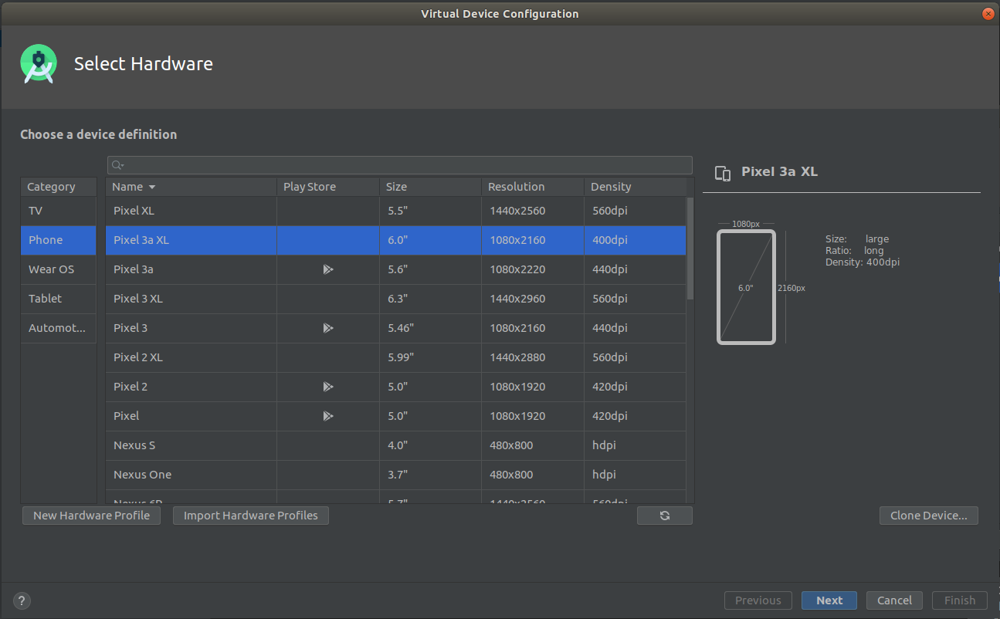
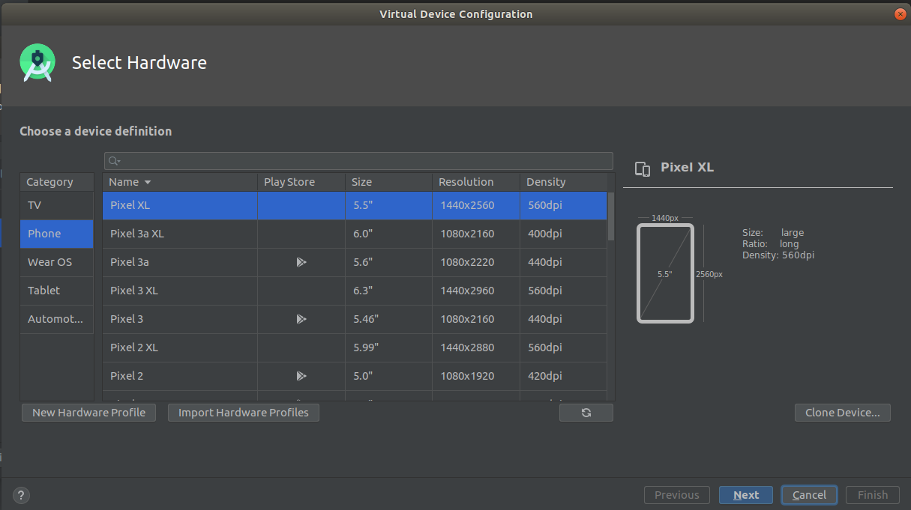
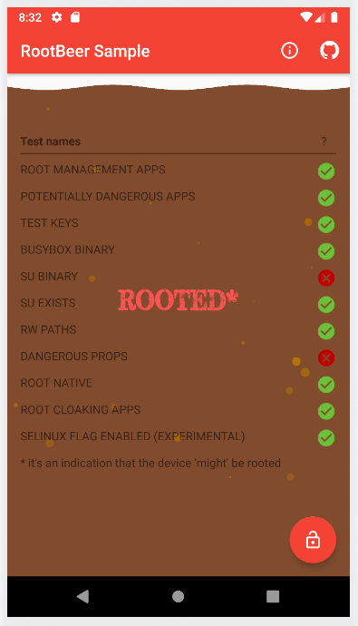

# Root

There are several ways to detect root in an Android device. Most of them are implemented in <https://github.com/scottyab/rootbeer>, an open source library mentioned in OWASP's MSTG. We'll base our evasion techniques on the controls implemented in this library.

## Root environment

First we need a root environment. We'll use the default [Android emulator](https://developer.android.com/studio/run/emulator)



Choose a device without Google Play Services installed.



To obtain a root shell we first must type:

```console
$ adb root
restarting adbd as root
```

and then launch the shell

```console
$ adb shell
generic_x86_64:/ # whoami
root
```

We now have a device with full permissions.

## Installation of RootBeer

Clone the git project

```console
$ git clone git@github.com:scottyab/rootbeer.git
Cloning into 'rootbeer'...
remote: Enumerating objects: 33, done.
remote: Counting objects: 100% (33/33), done.
remote: Compressing objects: 100% (24/24), done.
remote: Total 1779 (delta 2), reused 20 (delta 0), pack-reused 1746
Receiving objects: 100% (1779/1779), 2.70 MiB | 2.79 MiB/s, done.
Resolving deltas: 100% (735/735), done.
```

Get into the folder and run `gradlew`

```console
$ ./gradlew installDebug

> Configure project :rootbeerlib
Compatible side by side NDK version was not found.

> Task :app:stripDebugDebugSymbols UP-TO-DATE
Compatible side by side NDK version was not found.

> Task :app:installDebug
Installed on 1 device.

BUILD SUCCESSFUL in 6s
44 actionable tasks: 1 executed, 43 up-to-date
```

After this we'll have our app installed in the android drawer.

## Base test

We'll first launch the RootBeer demo app on our root enviornment to see which controls detects.



We can see that our enviornment got detected because we have a su binary and modified properties file.

## Bypassing binary detection
