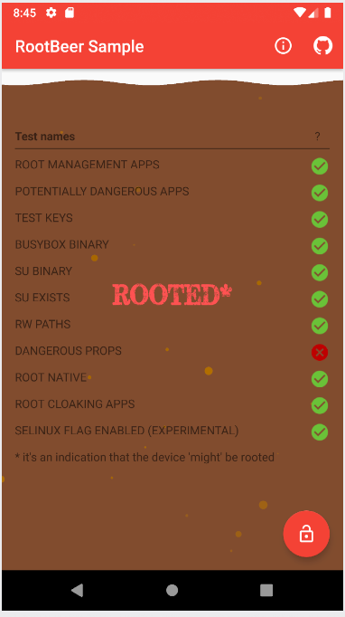

# Root

There are several ways to detect root in an Android device. Most of them are implemented in <https://github.com/scottyab/rootbeer>, an open source library mentioned in OWASP's MSTG. We'll base our evasion techniques on the controls implemented in this library.

## Root environment

First we need a root environment. We'll use the default [Android emulator](https://developer.android.com/studio/run/emulator)


Choose a device without Google Play Services installed.


To obtain a root shell we first must type:

```console
$ adb root
restarting adbd as root
```

and then launch the shell

```console
$ adb shell
generic_x86_64:/ # whoami
root
```

We now have a device with full permissions. To run it from command line type:

```console
~/Android/Sdk/emulator/emulator -avd root
```


## Installation of RootBeer

Clone the git project

```console
$ git clone git@github.com:scottyab/rootbeer.git
Cloning into 'rootbeer'...
remote: Enumerating objects: 33, done.
remote: Counting objects: 100% (33/33), done.
remote: Compressing objects: 100% (24/24), done.
remote: Total 1779 (delta 2), reused 20 (delta 0), pack-reused 1746
Receiving objects: 100% (1779/1779), 2.70 MiB | 2.79 MiB/s, done.
Resolving deltas: 100% (735/735), done.
```

Get into the folder and run `gradlew`

```console
$ ./gradlew installDebug

> Configure project :rootbeerlib
Compatible side by side NDK version was not found.

> Task :app:stripDebugDebugSymbols UP-TO-DATE
Compatible side by side NDK version was not found.

> Task :app:installDebug
Installed on 1 device.

BUILD SUCCESSFUL in 6s
44 actionable tasks: 1 executed, 43 up-to-date
```

After this we'll have our app installed in the android drawer.

## Base test

We'll first launch the RootBeer demo app on our root enviornment to see which controls detects.


We can see that our enviornment got detected because we have a su binary and modified properties file.

## Bypassing binary detection

In order to evade the detections we must first understand how we got detected. In the case of RootBeer, the library is open source, so we can directly look up the code.

Const.java

```java
public static final String BINARY_SU = "su";

// ...

// These must end with a /
public static final String[] suPaths ={
        "/data/local/",
        "/data/local/bin/",
        "/data/local/xbin/",
        "/sbin/",
        "/su/bin/",
        "/system/bin/",
        "/system/bin/.ext/",
        "/system/bin/failsafe/",
        "/system/sd/xbin/",
        "/system/usr/we-need-root/",
        "/system/xbin/",
        "/cache/",
        "/data/",
        "/dev/"
};
```

RootBeer.java

```java
public boolean checkForSuBinary(){
    return checkForBinary(BINARY_SU);
}

//...

public boolean checkForBinary(String filename) {

String[] pathsArray = Const.getPaths();

boolean result = false;

for (String path : pathsArray) {
    String completePath = path + filename;
    File f = new File(path, filename);
    boolean fileExists = f.exists();
    if (fileExists) {
        QLog.v(completePath + " binary detected!");
        result = true;
    }
}

return result;
}
```

As we can see the software looks for a file called `su` in the usual paths where it can be found in a normal installation. To see where we have the binary we can do the following:

```console
generic_x86_64:/ # which su
/system/xbin/su
```

The /system is mounted as read only, so we cannot modify it just yet. In order to do so in an emulator, we must start it with the flag `-writable-system`

```console
~/Android/Sdk/emulator/emulator -avd root -writable-system
```

And then remount the partitions with

```console
adb remount
```

It is important to maintain the `su` permissions and ownerships in order not to break anything

```console
generic_x86_64:/system/xbin # ls -la su
-rwsr-x--- 1 root shell 11056 2019-04-11 00:54 su
```

Now we can rename the su binary in order to avoid detection.

```console
generic_x86_64:/system/xbin # mv su suu
```

Now we can call the binary su with its new name in order to become root.

```console
generic_x86_64:/ $ suu
generic_x86_64:/ #
```

Meanwhile, the control is correctly bypassed



## Bypassing dangerous properties detection

RootBeer control looks for 2 specific properties and returns True if any of them are set.

```java
public boolean checkForDangerousProps() {

    final Map<String, String> dangerousProps = new HashMap<>();
    dangerousProps.put("ro.debuggable", "1");
    dangerousProps.put("ro.secure", "0");

    boolean result = false;

    String[] lines = propsReader();

    if (lines == null){
        // Could not read, assume false;
        return false;
    }

    for (String line : lines) {
        for (String key : dangerousProps.keySet()) {
            if (line.contains(key)) {
                String badValue = dangerousProps.get(key);
                badValue = "[" + badValue + "]";
                if (line.contains(badValue)) {
                    QLog.v(key + " = " + badValue + " detected!");
                    result = true;
                }
            }
        }
    }
    return result;
}
```
